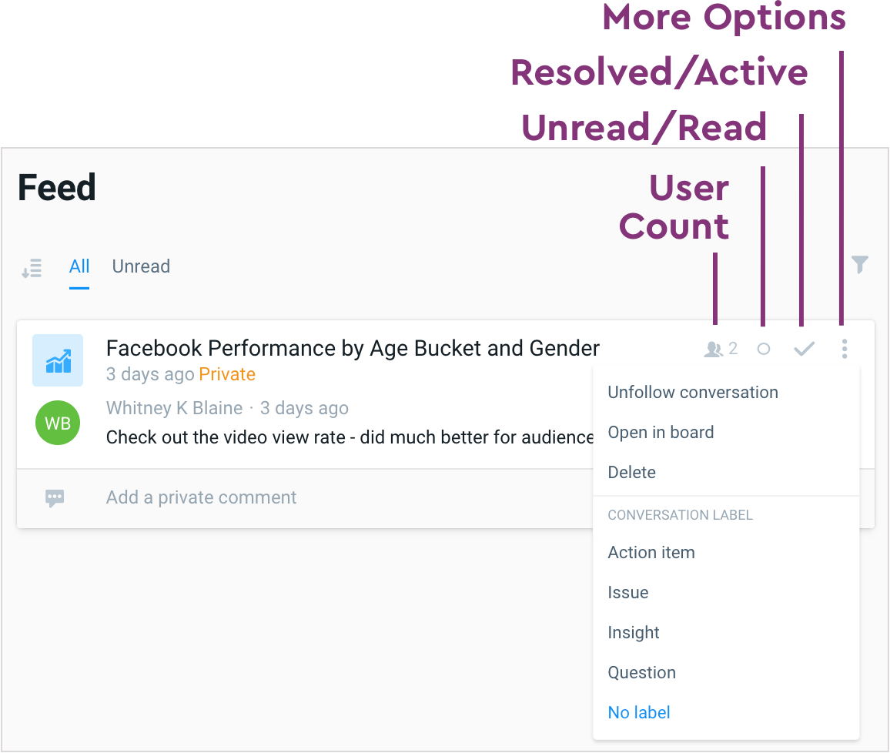
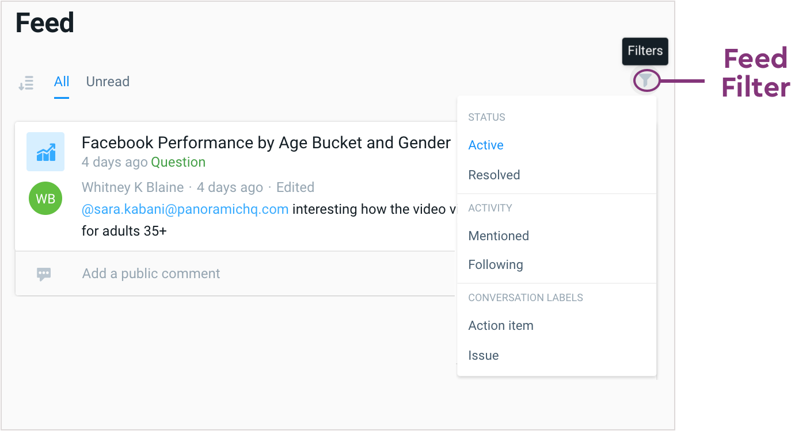

# Activity Feed

#### **Feed Navigation**

Every time you enter a Workspace, your Feed will be your default screen. Once you save a Chat, it will appear within that Workspace Feed. If you would prefer to be notified of any activity around this Conversation, or organize your Conversations, there are several actions you can take, that appear on the right of a Conversation within your Feed:

**NUMBER OF PEOPLE, MARK UNREAD/READ, MARK RESOLVED, MORE OPTIONS.**

* **NUMBER OF PEOPLE -** if you created or are tagged in a private message, the person icon displays the number of people involved in this Conversation
* **MARK READ/UNREAD -** select the circle icon to mark a Conversation as Read or select it again to mark it as Unread. Indicate this at the tab at the top in the new image
* **MARK AS RESOLVED/ACTIVE -** to remove this Conversation from your Feed, select Mark as Resolved. Select this icon again to Mark the Conversation as Unresolved.
* **MORE OPTIONS -** if you select this icon, you have several additional options to take within a Conversation:
  * **Unfollow the Conversation** - if this Conversation appears on your Feed but isn’t relevant to you \(for example, a message to your entire team where you get notified\), you can Unfollow it to stop receiving notifications when new responses appear
  * **Open in Board** - this option allows you to go to the Conversation alongside the visual it is referencing
  * **Delete** - if you are an Admin, you can delete this Conversation
  * **Conversation Label** - if you have not yet labeled the Conversation, or would like to relabel it, you can select an applicable label from the **More Options** dropdown
* **LABEL -** organize your Chats by type, such as Action Item, Question or Insight
* **PRIVATE/PUBLIC -** displays whether your Chat is Public or Private, including the number of Collaborators included on this Chat \(if Private\)

#### **Feed Filters**

At the top right of your Feed is your **Feed Filter**, where you can filter messages by the following options:

* **MESSAGE STATUS**
  * **All** - displays all Read and Unread Messages
  * **Unread** - displays ONLY Unread Messages
* **ACTIVITY**
  * **@ Mentions -** displays ANY messages that you are directly mentioned via the @mention. These can include both private and public messages.
  * **I'm Following -** displays ONLY messages that you are Following
* **CONVERSATION LABELS**
  * **Action Item -** if you want to get back to this item again soon, or include next steps to the Conversation, use this Label
  * **Issue -** if these is something that looks wrong, either from your data or in the platform, use this Label

_Note: As a reminder, your Feed is only available at the Workspace level, while your Inbox is available at the Company level._

