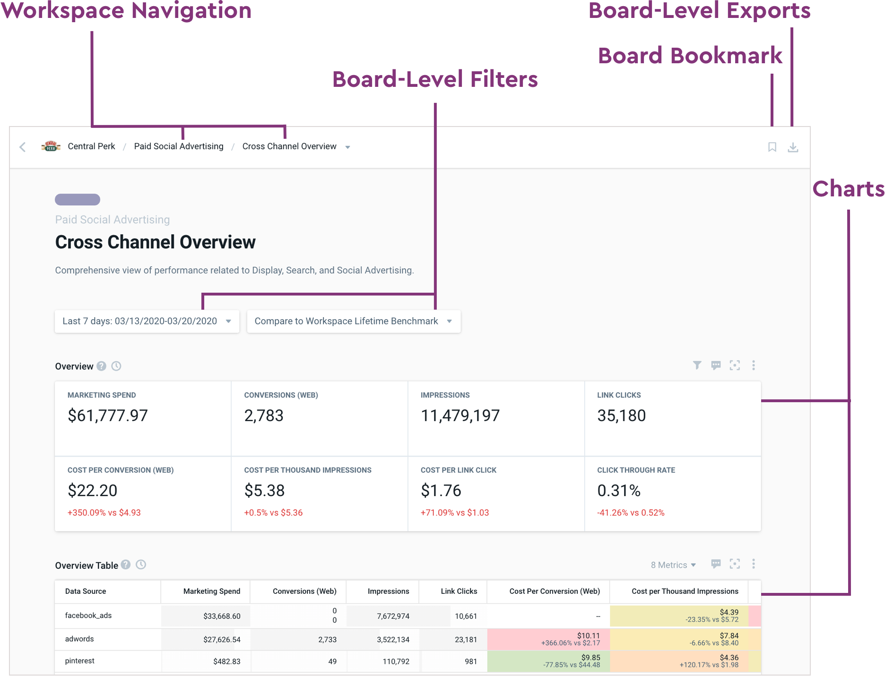

# Boards

## **Anatomy of a Board**

A Board is a collection of dataframes in a sequential order, saved within one of your Workspaces. Boards display the information you need to answer relevant business questions. 

Boards consist of the following Sections:

* **Workspace Navigation -** enables you to move back to the respective Boards tab or to the Main Workspace Menu
* **Board-Level Exports** - easily export any of your visuals to PDF or Excel
* **Board Bookmarks** - bookmark a Board so you can easily come back to it every time you enter your Workspace
* **Board-Level Filters** - allowing you to apply a Date Filter and a Benchmark once that then affects all Charts within that Board
* **Charts** - visual representations of your data

To View a **Board**:

1. Navigate to your desired Workspace
2. Select **BOARDS** from the Main Workspace Menu
3. Select the relevant Board you want to see
4. Scroll through the Charts available on that Board, experiment with: Date Filters, Board Filters, Benchmarks, Exporting Functionality and Chart Filters

## **Create Custom Boards and Charts**

Custom Boards are any Boards that have been customized to fit your unique reporting needs. As mentioned in the Overview, to create a Custom Board with visuals useful for analysis, you’ll need to create both a **Custom Board** and **Custom Chart**.

To Create a Custom Board:

1. Log in to your Pano account
2. Navigate to your desired Workspace
3. Select **CUSTOM BOARDS** from the Main Workspace Menu
4. Select **CREATE BOARD** to the far right of the Custom Boards screen
5. To customize your Board, select the Pencil icon on the right. Here you can update the Board Name to a name of your choice, and/or select a color for your Board.
6. Select **SAVE** to confirm your customizations.

