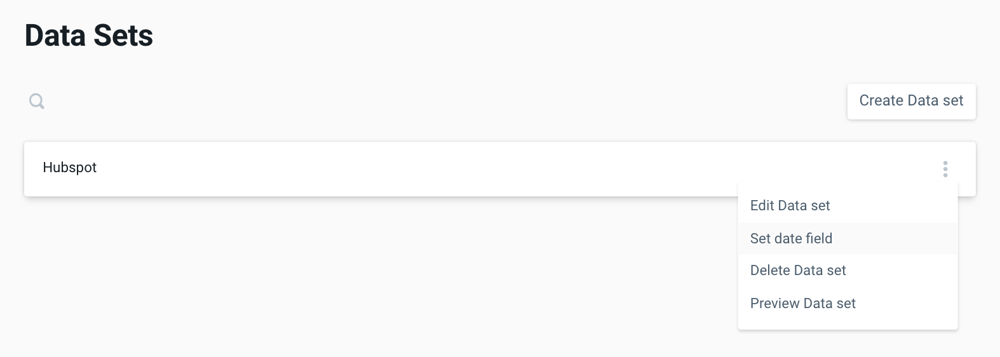
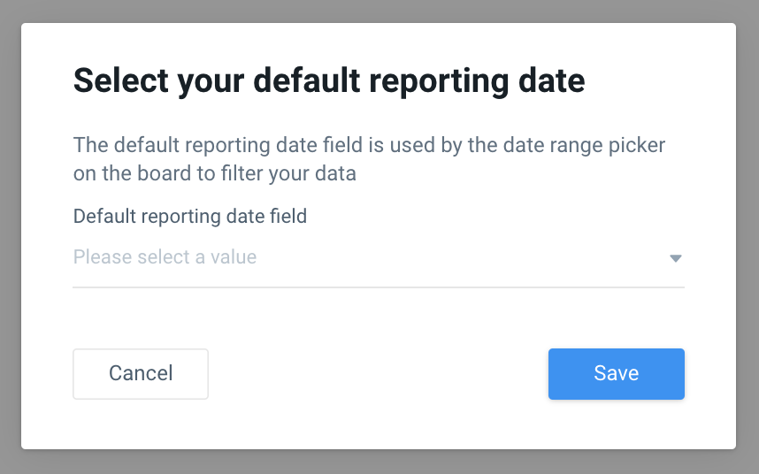

# Datasets

## What is Data Mapping?

Data mapping is the process of defining how individual fields are mapped, modified, joined, filtered, aggregated etc. to produce the final desired output for analysis. 

## What is a dataset?

Also known as a “universe” of data, a dataset forms a group of tables that have an implicit relationship between the data. Usually all of these tables come from the same source, such as Facebook Marketing API, or Shopify API. The set of tables within a dataset have implicit joins between them, usually in the form of primary keys and foreign keys like campaign\_id or product\_id. These tables may also include

## Naming a dataset

* Datasets, like many objects in the pano system, are split into two parts, a slug and a display name.
  * A slug is a human readable identifier that is used by our system to uniquely identify an object in the pano system. Slugs are always unique strings and cannot be modified once they are created.
* The Display name is the label associated with the slug that will be used for display in all platform UI elements and data models. Since the slug cannot be changed once its created, we offer the display name as the available field to use to modify how a Dataset is presented, updated and displayed for Panoramic users.
  * A common example of this idea is Google’s “Adwords” platform. You may first create a dataset to map “adwords” data and it would have a slug and display name of “Adwords”. However Google decided to rebrand its platform to “Google Ads”. In our system the dataset slug would still remain “adwords” but you can easily update the display name to “Google Ads” without having to rebuild all of your Dataframes.
* In the UI you can create and manage Datasets directly, you will not need to create a slug in the UI as one will be created for you based on the first display name you input.
* In the CLI you should create a new folder per Dataset that you wish to create and name that folder with the same name as the dataset slug.
  * Once the folder is created, you should create a file called “dataset.yaml” within that folder and complete the following values within the file:
    * api\_version: \[v1\]
    * Dataset\_slug: \[alphanumeric\_string\_name\]
    * Display\_name: \[“My Pretty Name”\]

## Copying scanned files into datasets

In order to make the tables in your data connection available for modeling and querying, the scanned files must be **copied** over into a dataset. Working with the CLI this means copying the relevant scanned model files into the dataset folder you just created. In the UI you should navigate to the dataset detail view and click the “add models” button, then select and add the relevant models from the list.

## Creating model files

Once you’ve copied all your scanned files into their respective dataset folders, you are ready to start modifying your models to meet all your reporting needs. Editing models can be done by modifying four key areas:

* **Fields -** The mapping between columns of data in your data warehouse and queryable “fields” in the pano system
* **Identifiers -** A list of the dimension fields that represent a unique row of data \(or compound keys\) in a model. These are used to tell Pano how data is structured and how best to query it.
* **Joins -** A definition of the relationship between multiple models. Defining joins declares which fields in each model are related \(can be JOINed in SQL terms\) and defines the relationship between the data in each model \(primary vs foreign, left vs inner join\)
* **Projections -** The ability to transform the underlying structure of an existing table in your data connection. Sometimes this is necessary in order to structure the data in a format that is queryable by Pano \(such as pivoting rows to columns or pre-aggregating raw event level data\). Projections are written in pure SQL and are executed first in the data transformation process.

## Defining a Reporting Date

The vast majority of analytical metric tables include some date or time dimension. This time dimension is the most common way to update your data with new data and track for any missing gaps. This time dimension also comes in handy when you want to analyze and report on the data since it helps answer time-based questions like "How much have I spent today?" or "How many sales did I get last week?".

Once you have defined a Dataset in Pano, it is important to define which field should be used as the Reporting Date. Pano will use this field as the universal date dimension when viewing metrics for the Dataset.

## Publishing your Dataset

Once you are finished editing your models you can either a\) push to production via the CLI or b\) click save in the platform in order to publish all your changes and make your datasets, models and fields available for querying. As soon as you publish your fields they will become available in the Data Glossary. This is the view where you and any other members of your team can view all the fields that have been mapped and you can add context like what that data means and how it can be used for reporting.

When initially publishing Datasets, Pano makes a few assumptions about how each field will be used based on its data type. These assumptions are based on hundreds of thousands of tables scanned and are best practices for getting up and running quickly. With that said, these defaults will only get you started and many fields will need to be updated to better reflect the intricacies of your underlying data.

* All text or date type fields will be created as dimensions by default
* All numeric \(decimal, float, integer\) fields will be created as metrics with an aggregation type of SUM by default

Once the fields are available in the glossary you are free to go in and edit any of the attributes associated with fields. One of the benefits of Pano is that you can easily edit the meaning of fields in one central location without having to go change the logic in every model where that field is referenced.

* _We recommend reviewing the defaults on all new fields to ensure they are properly defined as a dimension or a metric, that they have the correct aggregation type and that the display formatting is properly defined._

