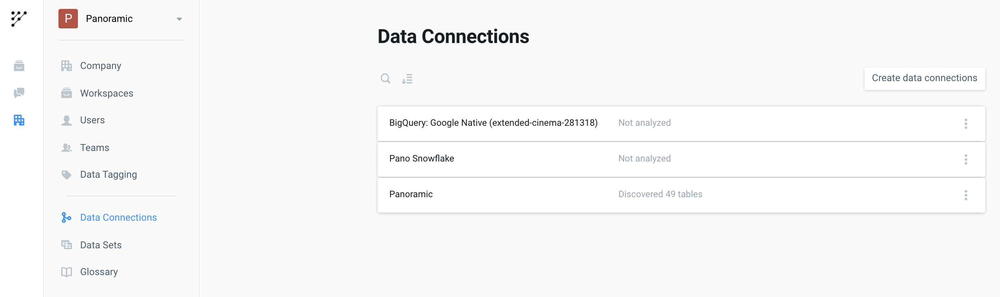
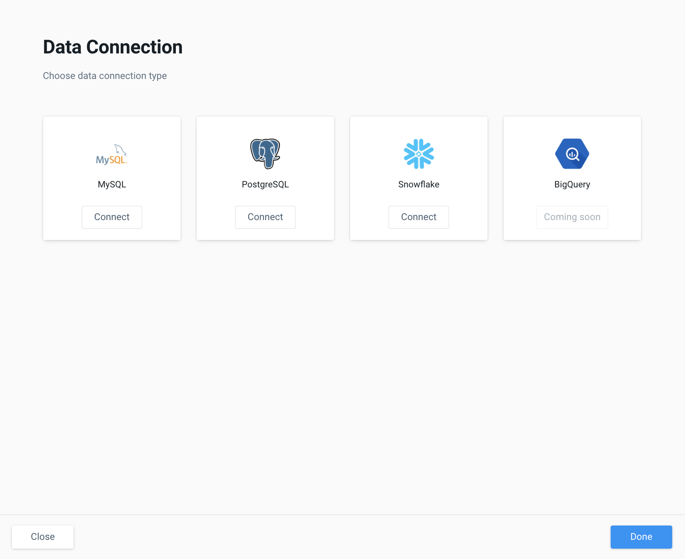

# Data Connections

## What is a Data Connection?

A Data Connection in Pano is a secure link to a source of data owned and managed by you. \(for example: transactional databases, cloud data warehouses, CSV files...\) This connection allows Pano to view your tables, build a data model and query your data for analysis, transformation and reporting. 

To get started with Panoramic, you must **connect to your Data Warehouse first**, then start your modeling process to create **Datasets**.

Please also refer to our guide on **Scanning your Data Warehouse** for details on what to do after you've connected your first data warehouse.

