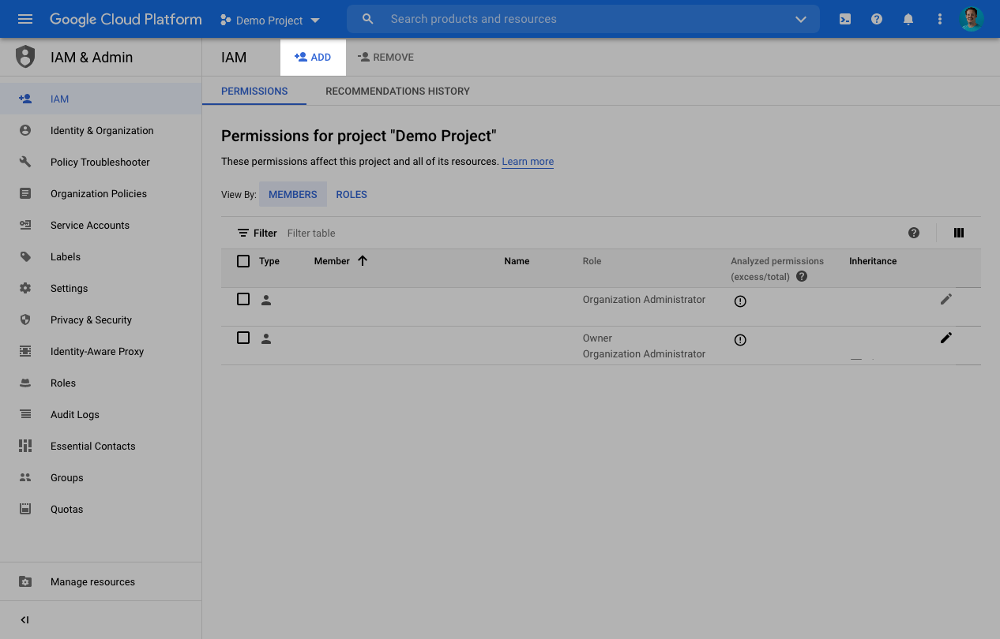
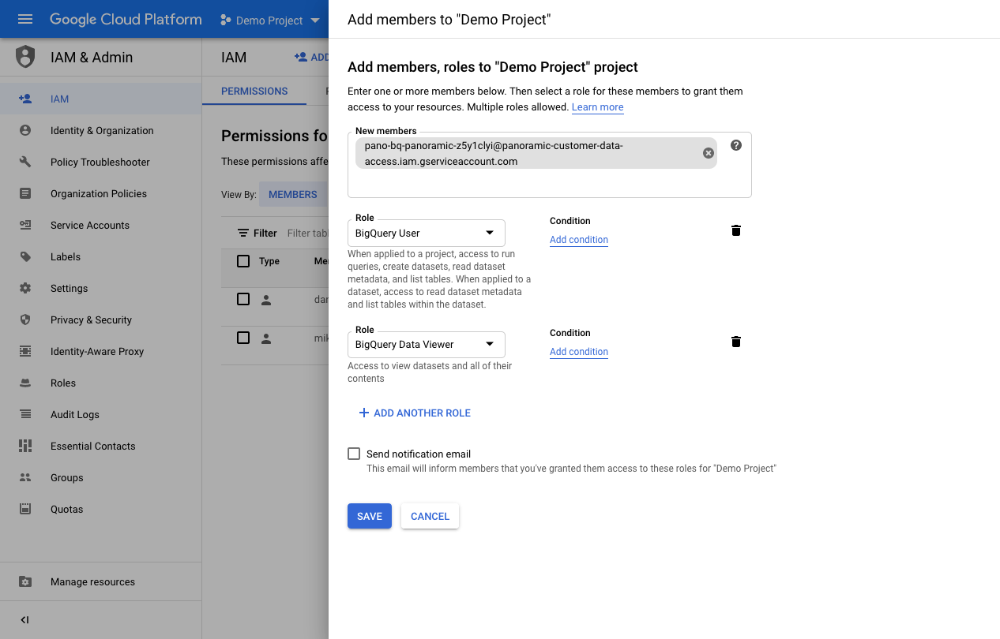
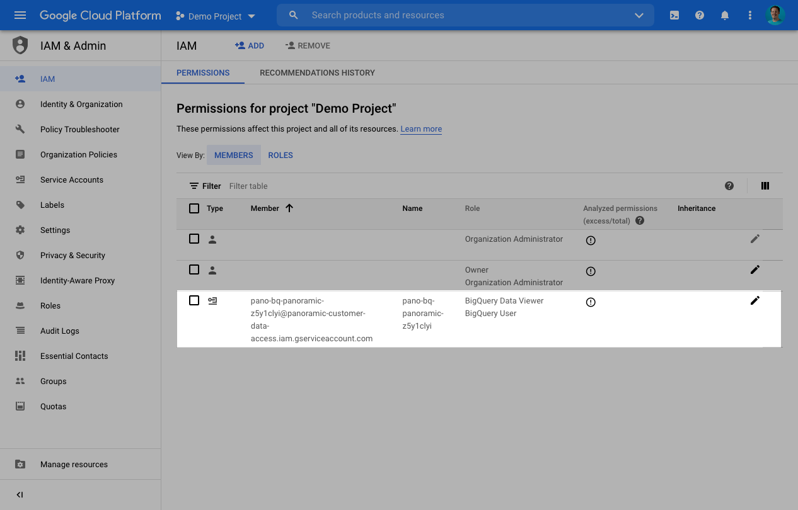

# Connect to your Database

## Why do I need to Create a DB User?

In order to utilize Pano, we need access to your data warehouse. While it's certainly possible to use an existing database user, our recommended best practice is to create a user specifically for Pano.

This enables you to give Pano only the access required to help you understand & transform your data. It also makes it easy for you to monitor every query that is run and the data Pano accesses.

#### What Permissions will I need?

* Read Access \(GRANT SELECT permission\)
  * Data Preparation
  * Data Definition
  * Data Transformation
  * Data Monitoring & Insights
* Read & Write Access \(GRANT ALL PRIVILEGES permission\)
  * Data Integration

## SQL Helpers to create users & grant permissions

Pano recommends creating a dedicated user for the Pano platform. This makes it easier for your engineering team to manage access controls and monitor usage & performance. 

### MySQL

```sql
-- create user
CREATE USER 'PANO'@'%' IDENTIFIED BY 'USE_A_NICE_STRONG_PASSWORD_PLEASE';

-- grant select for this user
GRANT SELECT ON mydb.* TO 'PANO'@'%';

-- grant all for this user
GRANT ALL PRIVILEGES ON mydb.* TO 'PANO'@'%';
```

### PostgreSQL

```sql
-- create user
CREATE ROLE PANO WITH LOGIN ENCRYPTED PASSWORD 'USE_A_NICE_STRONG_PASSWORD_PLEASE';

-- grant connect privilege
GRANT CONNECT ON DATABASE mydb TO PANO;

-- repeat this for other schemas too
GRANT USAGE ON SCHEMA public TO PANO;
GRANT SELECT ON ALL TABLES IN SCHEMA public TO PANO;

-- remember to repeat this for other schemas too
GRANT ALL PRIVILEGES ON ALL TABLES IN SCHEMA public TO PANO;
```

### Snowflake

### Google BigQuery

When connecting BigQuery, we will generate a Google Cloud [service account](https://cloud.google.com/iam/docs/service-accounts) unique to your company. You will then need to grant that user access to the Google Cloud Project that contains your BigQuery data.

Pano requires the following roles in Google Cloud:

| Role | Where | Reason |
| :--- | :--- | :--- |
| BigQuery User | Project | Gives Pano permission to see the schema of tables in your account, and gives us permission to create jobs to query the data from your account |
| BigQuery Data Viewer | Project or tables | Gives Pano permission to access the data in your account. The recommended approach is to grant this role on the project level, but if you prefer to limit the access that Pano has to your data, you can use the [sharing feature](https://cloud.google.com/bigquery/docs/dataset-access-controls) to only grant this role on specific tables you want us to access. |

You will need to create a new BigQuery connection in the console. This will give you your unique service account email address. You will need to put this into the Google IAM console:



After clicking the "Add" button, you will be presented with a screen where you must input the service account and grant roles to it. Once you grant the correct roles, your screen should look like the following:



Finally, click the "Save" button and verify the account is added correctly:



### Amazon Redshift

```sql
-- create user
CREATE USER PANO PASSWORD 'USE_A_NICE_STRONG_PASSWORD_PLEASE';

-- repeat this for other schemas too
GRANT USAGE ON SCHEMA public TO PANO;
GRANT SELECT ON ALL TABLES IN SCHEMA public TO PANO;

-- remember to repeat this for other schemas too
GRANT ALL PRIVILEGES ON ALL TABLES IN SCHEMA public TO PANO;
```

