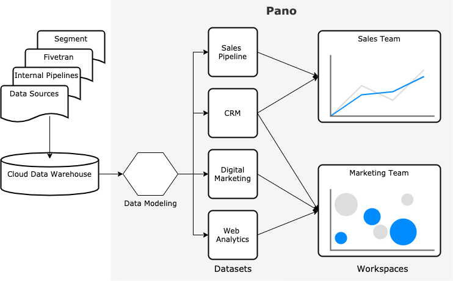

# Overview

> "Data preparation is a must-have technology for enabling business teams to find, prepare and share heterogeneous data for their integration, analytics and data science use cases"

- Gartner

## What is Data Preparation?

Data preparation, also known as data cleaning, is the process usually taken on by data engineers and data analysts to organize data into a format that it is easily queryable through simple SQL queries or via BI tools.

Data preparation is the first step in data analytics projects and can include many discrete tasks such as:

* Pre-aggregating data - some data comes in at a very granular level, like event level site analytics data, it is necessary to pre-aggregate this data so that it can be queried reliably by common BI tools
* Type Casting - updating the data types to ensure they are correct and match across all tables. Sometimes metrics show up as strings, sometimes IDs show up as decimals, they need to be corrected before any further analysis can take place
* Normalizing text - making sure that names are set up the exact same across multiple systems so they can be properly joined and aggregated for reporting
* Fixing Typos - aka fixing misspellings, typos and other common user mistakes so the data matches
* structuring datasets - transforming unstructured JSON or arrays of data into easier to query, relational, columnar data tables
* Deduplication of rows - sometimes the same report is fetched multiple times from an api, If both of these reports include the same date then there is a chance the metrics could be duplicated, this is why its important to declare identifiers, which can be used to remove duplicates and only query the latest, most up-to-date version of a specific report

## How Does Panoramic Help?

### Datasets

Also known as a “universe” of data, a dataset forms a group of tables that have implicit relationships between them. Usually all of these tables come from the same source, such as Facebook Marketing API, or Shopify API. The set of tables within a dataset have implicit joins between them, usually in the form of primary keys and foreign keys like campaign\_id or product\_id.

### Data Models

Data "modeling" can mean many things depending on the context and the language/platform you are working with. In general, data modeling refers to the process of making sense of physical data by applying business logic that is not available directly in the underlying database. This logic, or metadata, often includes things like descriptions for what each column means, where the data came from, how multiple tables can be joined together, etc. 

The process of data modeling aims to:

* Consolidate data from multiple data sources
* Transform data to produce business-friendly datasets that are easier to query and to interpret
* Give business meaning to raw data generated from your system with metadata
* Promote data self-service and collaboration

#### Field Mapping

Panoramic works a bit differently from typical data modeling tools in that we have abstracted fields \(or columns\) from the models \(or physical tables\) where they exist. In analytical data modeling, its very common for the same field to exist in multiple tables, for example, you may have a column for "spend" that exists in your raw event table, your daily aggregated reporting table and your monthly billing table. All three of these columns represent the same conceptual field and are often even aggregated from one table up to the next. In Panoramic, we will map all three of these columns to the same "spend" field. This allows us to centralize management of the field, how it should be aggregated, formatted, what it means, etc. We can then separate this information from the actual tables where the field exists. This makes it much easier to map columns to fields, since you don't need to copy extensive metadata into every file where the field exists, as well as much faster to update since changes to the centralized field definition instantly apply everywhere where the field is referenced. Think of it as a relational database for your relational database!

#### Identifiers

Identifiers are used to determine the uniqueness of a row of data in a table. Every model should have one or more identifiers defined. The general idea is that no two rows in a table can have the same values for the set of identifiers defined. So if I have a table and I declare "date" as the only identifier in that table, then there should only ever be one row for each date. Identifiers allow queriers, like your analyst, or pano, to know how the data in the table is structured and what is the best way to ask for it.

Identifiers are commonly referred to as primary keys or compound keys. In traditional relational databases, these keys can be set in the table definition, and 9 times out of 10 those keys will match the Panoramic identifiers. But not all cloud data warehouses support implicit primary key and foreign key definitions. For these cloud warehouses you need to go and define the identifiers in the data model, even though they are not strictly enforced by the warehouse itself.

#### Joins

Joins allow you to define the relationships between your models. Joins in Pano behave exactly the same as joins in SQL, only with a few caveats to ensure you get the most efficient and accurate querying of your data. Pano only supports Left joins and Inner joins. All joins should be defined from the most granular metric model out to the least granular entity model. This approach helps reduce issues where metrics may be accidentally filtered out due to any incorrect assumptions around entity relationships. Models can be joined on one or more fields, so long as all the joined fields exist and are mapped in both models.

#### Projections

Data projections are pure SQL transformations applied to an existing data table to convert it into a new structure, this is commonly used to pre-aggregate raw event data, remove duplicate records from a table or to flatten rows into columns so they can be queried more reliably.

