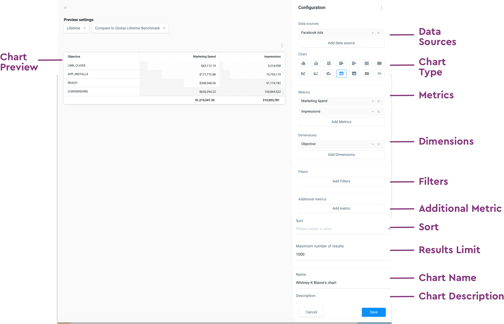

# Data Explorer

## **What Is Data Explorer?**

Data Explorer is the feature that allows any Admin or Edit user to create their own customized charts and boards, utilizing the connected data sources, in any Workspaces.

* Charts visualize data for multiple data sources
* Create multiple charts per board
* Boards may include multiple chart types \(table vs. line graph\)
* Feature that allows users to create Custom Boards

**Data Blending** allows you to build charts that incorporate multiple platforms \(ie. Facebook/IG and Google Search\), and "blend" together metrics that do not map across those platforms 1:1. Data Blending is supported by Custom Terms, Chart Builder, and the Glossary. This article will explain what those platform features are, and how you can use them to blend data cross-platform.

At the top you will see the chart that you've built and can publish, and at the bottom you'll see the tab for "Blended data", as well as the Facebook, Twitter and Snap specific data. These sections will show you which fields are supported by what data source.

## **How to build your data transformation**

Sacha wants to build a chart for Facebook, Snap and Twitter data, but she knows that "Initiate Checkout" does not exist in Twitter and Snap. She wants an easy view of multi-platform data, even if all the platforms don't share the same metrics. What does she do?

#### Select your Data Sources 

The Data Sources displayed are determined by the Data Sources added to your Workspace. You can add multiple data sources, but your metrics and dimensions must map across all data sources. If they do not, you will need to use **Data Blending.** 

Data sources are used to determine what subset of the data universe should be available in the transformation. You have the option to pull in data from as many data sources as you'd like but only the data sources linked to the workspace will be available to select.

**Dimensions**

Now it’s time to add Dimensions. Depending on the Chart type selected, you will be able to select Rows and Columns, or Dimensions and Breakdowns.

**Metrics**

to add a Metric, such as CPM, to your new chart. Available metrics for this data source will be listed in the dropdown below

**Additional Metrics**

In addition to applying FILTERS, you can also apply **ADDITIONAL METRICS**, located below the Filters option. Select **ADD METRIC** to see a dropdown of available metrics.

Every visual chart type is paired with a table directly below it, where your additional metrics will be displayed. There is no limit to the number of metrics you can add.

Now that you’ve added **METRICS** and **DIMENSIONS**, your chart will start to come to life. If any data looks off, applying **FILTERS** is a good way to display the data most relevant to you.

#### Sorting

#### Limits

#### Name & Description

Now that you’ve created your chart, name your Chart and give it a Description.

#### Saving your Transformation

1. Navigate to a Custom Board within your desired Workspace
2. Select **CREATE CHART** within your Custom Board
3. Select from the following options:
   1. **ADD DATA SOURCE -** add one or more Data Sources that you want to visualize. Note, any Data Sources you’ve connected to your Workspace will appear in this Dropdown \(see Connecting Data Sources for more information\).
   2. **SELECT CHART TYPE -** you have X types to choose form. The Table chart type will be selected by default.
   3. **ADD METRICS -** select this option to add a Metric, such as CPM, to your new chart. Available metrics for this data source will be listed in the dropdown below.
   4. **ADD DIMENSIONS -** depending on the Chart type selected, you will be able to select Rows and Columns, or Dimensions and Breakdowns
   5. **ADD FILTERS -** select this option to display the data most relevant to you. A Filters popup will appear where you can remove items like unknown fields, or set limits to the data you want to see based on a dimension or metric. Be sure to select the **+** sign to add your field. Once you’ve added a filter, select **APPLY.**
   6. **Additional Metrics -** Every visual chart type is paired with a table directly below it, where your additional metrics will be displayed. These metrics will also appear once you have saved your Chart and use it on an ongoing basis. There is no limit to the number of additional metrics you can add.
   7. **SORT -** select this option if you want to see your data sorted in a particular order
   8. **Results Limit**
   9. **Chart Name -** enter a Name for your Chart. If you do not enter a Name, the default Chart Name will be your User name
   10. **Chart Description** - enter a Description for your Chart. This field is optional.

