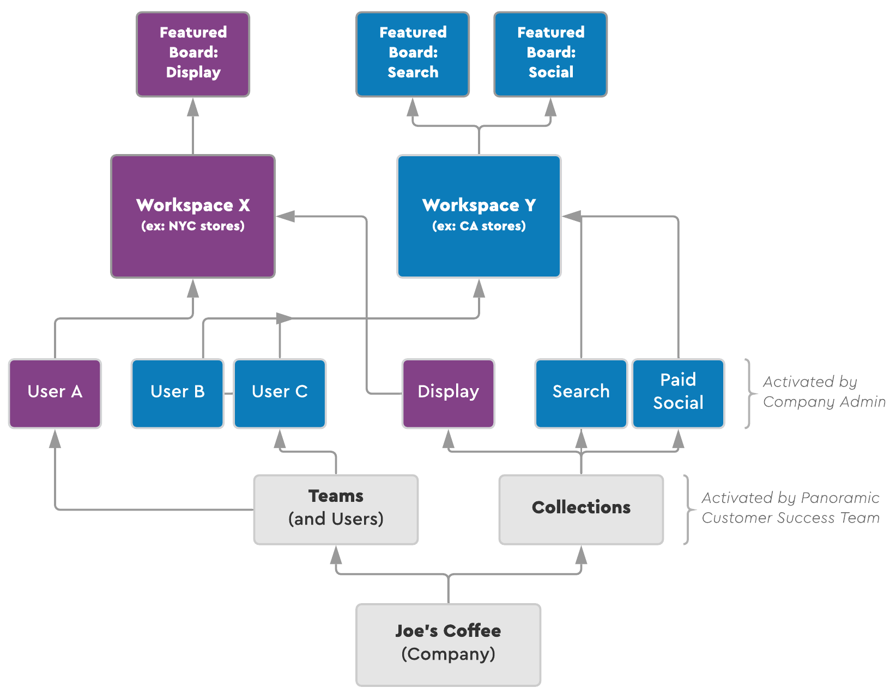

# Workspaces

## **What is a Workspace?**

Workspaces are secure areas for teams to collaborate around their data. Within one Company, there can be multiple Workspaces.

Workspaces allows you to group together relevant visuals and data, while allowing you to customize permissions \(e.g. giving access to one agency for certain campaigns, or sectioning off access per teams for different product lines\).

Workspaces are commonly used to separate your marketing data by:

* campaigns
* product lines
* store locations or regions
* initiatives
* movie titles

For example, if you are a film studio, you would likely create a new project for each film you work on. If you run an e-commerce website, you might create different projects for each product, major campaign, or break give your agency different access from your brand team. We recommend you work closely with the Customer Success team to help organize based on your company structure and goals.

## **Creating a Workspace**

If this step has already been done for you by Panoramic, disregard this section. If not, continue reading to create a Workspace.

1. Log in to your Panoramic account
2. Select the **COMPANIES** tab from your Main Menu
3. Under your Company Settings Menu, navigate to the **WORKSPACES** tab
4. Select **CREATE WORKSPACE** on the top right corner
5. Name your Workspace \(Note: Workspaces are commonly created to create walled off views of some subset of your data, additional workspaces are commonly created for new product lines, multiple business regions, marketing seasons or initiatives like "holiday Campaigns" or "Branding", etc.\)
6. Select **CREATE**
7. Repeat Steps 3-5 to add additional Workspaces within your Company

### \*\*\*\*

For example, using the diagram above, let’s say you are the Admin for Joe’s Coffee and have different Workspaces for each store location, or what we’ll call Workspace X \(NYC Stores\) and Workspace Y \(CA Stores\):

* Tell your Customer Success rep that you’d like access to a particular collection. For Workspace X, you only want the “Display, Video and Programmatic Advertising” Collection, while with Workspace Y you’d like both the “Paid Search Advertising” and “Paid Social Advertising” Collections
* Your Customer success rep will then activate those Collections at the Company level
* You or another Joe’s Coffee Admin will turn on the respective Collections for both Workspace X and Y
* You add another User, a second Admin to the company Joe’s Coffee
* You and the other Admin then connect any desired data sources for each Workspace
* Now, everyone at Joe’s Coffee with access to Workspace X and/or Workspace Y can see Featured Boards and data flowing related to display, search or paid social marketing performance for these new store openings

## **Personalizing your Workspace**

Now that you are successfully oriented onto the Panoramic platform, it’s time to customize your Workspace to make it truly your own.

1. Navigate to your desired Workspace
2. Select **SETTINGS** from the Main Workspace Menu
3. Under General:
   * Choose an image for your Workspace. This could be the same image you used for your Company, or something visual specifically representing the Workspace \(e.g. photo of your product, key art for your movie, state image for your store location, etc.\)
   * Confirm the name and spelling of your Workspace. Type directly into the Name field to make any changes.
   * Select **SAVE** to ensure your image and name changes are updated, if you made any changes

