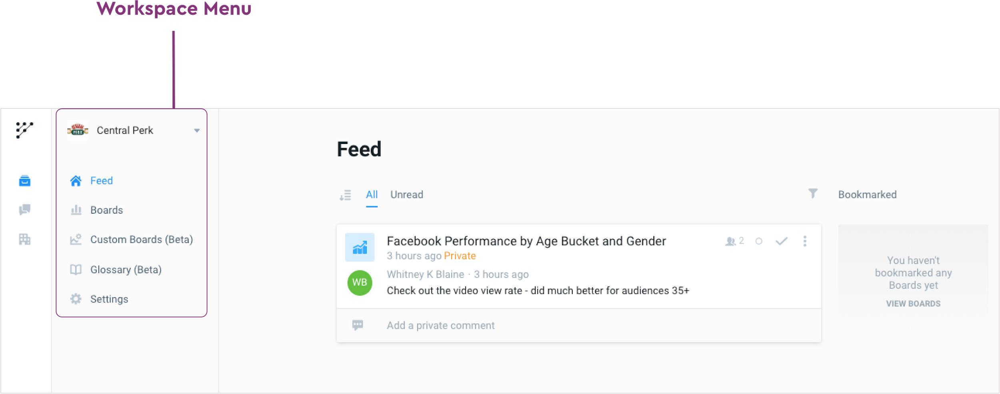

# Platform Overview

## Getting Started with Panoramic

Getting started is as easy as 3 simple steps and you can be up and running in less than 30 minutes by just following these three steps.

1. **Connect all your datasets** - already have the data, connect your data warehouse. Need help getting the data, Integrate with one of our Data Pipeline partners. Once you're connected, Data Preparation and Data Definition has never been easier to manage.
2. Let our unified **data transformation layer** inspect all of the data you connect and build useful, marketing specific models to speed up your analysis
   1. Have something totally custom, dive in deep and configure your own custom models
3. Invite teams into **Personalized Workspaces** and let them start safely customizing their metrics, setting up monitoring and letting the system push insights to them, freeing up more time to focus on the business

## Lets dive a little deeper into the anatomy of the Panoramic platform

When getting started using a new platform, it can often take time to “learn the ropes.” At Panoramic, we want to minimize that time so you get immediate value out of the platform. The below diagram shows the way our platform is organized in an effort to help you quickly get up and running.

**BOARD -** Starting from the top of the diagram, a Board can be thought of as your “visual organizer.” As shown in the example above, a Board can consist of one or more charts. There are two types of Boards: **Featured Boards** and **Custom Boards**.

* **Featured Boards -** out-of-the-box Boards that appear soon after connecting your data to Panoramic. A Featured Board typically contains 5+ charts to provide you inspiration into how to analyze and visualize your marketing performance based on the type of channel \(i.e. programmatic advertising, paid social advertising, etc.\)
* **Custom Boards** - A Custom Board is a collection of charts that you, your team, or Panoramic’s internal team have created which are tailored to your specific reporting needs

**CHART -** Below the Board within the diagram above are three sample Chart types. A “Chart” in Panoramic is considered any visual, be it a chart, graph, or table. As you can see in the example, multiple Charts can comprise a single Board. A Chart “type” is the type of chart used to display your performance data. You can mix and match Charts from both **Featured Boards** and **Custom Boards.**

**FIELDS -** Below the Chart\(s\) in the diagram are Metrics and Dimensions, which are used to populate visuals or Charts according to your specific needs. Most organizations set marketing key performance indicators, or KPIs, which can be used to determine the right Metrics and Dimensions you need to best view your marketing data. Metrics and Dimensions provide context to the data sources that feed raw performance numbers.

* **Metrics** - Typically measurable items that can be considered a conversion or might require a calculation. Common examples include Cost Per Thousand Impressions \(CPM\), Video View Rate, Return on Ad Spend \(ROAS\), Click Through Rate \(CTR\).
* **Dimensions** - Attributes of a user or visitor, including where they saw your ad \(Region, Country\) or what type of audience they fell under \(Males, Ages 20-30, etc.\)

**DATASET -** The foundation of any individual Chart is the Data Source\(s\) that feed those visualizations. These Data Sources represent the raw data that is piped from an external tool, such as Facebook Ads or The Trade Desk. Our data team will pull all available data for each desired source, as far back in time as the source allows. Historical data \(often described as data over 6 months old\) can be used for accurate comparison and aggregation, often in the form of Benchmarks \(see [here]() more information on Benchmarks\).

### **Overall Navigation**

_**Main Menu Navigation**_

If you are an **Admin**, you will see the Main Menu, which displays three primary tabs:  
**WORKSPACES, INBOX**, and **COMPANIES.**

* **WORKSPACES -** secure areas for teams to collaborate around their data, while allowing Admins to customize permissions \(e.g. giving access to one agency for certain campaigns, sectioning off access per teams for different product lines, etc.\). Within one Company, there can be multiple Workspaces. Common examples of using more than one Workspace include separating marketing data by campaigns, product lines, store locations, or movie titles.
* **INBOX -** destination for all your message types \(Public, Private, Team-specific\) across multiple Workspaces. Inbox is especially useful if your Company uses multiple Workspaces.
* **COMPANIES -** independent entities, such as individual companies or distinct departments within a single company, that use one or more Workspaces to segment, map and visualize their data. Companies can set permissions for all Workspaces such as the **Data Glossary** or designate groups of users, also known as **Teams**.

_**Workspace Menu Navigation**_

After creating a Workspace within your Company, the new Workspace will appear upon logging in. After selecting a Workspace, you will see the Workspace Menu, which displays five primary tabs:

**FEED, FEATURED BOARDS, CUSTOM BOARDS, GLOSSARY,** and **SETTINGS.**

* **FEED -** destination for all your message types \(Public, Private, Team-specific\) within a given Workspace.
* **FEATURED BOARDS -** as described above, these are out-of-the-box Boards that come with pre-set Charts to help you quickly visualize your marketing performance without the need for any customization or ramp-up time. Once you activate a Collection \(see here for further details\), a Featured Board connecting visuals related to your specified Data Sources will automatically appear within this tab.
* **CUSTOM BOARDS** - as described above, these are any Boards that have been customized for you from Panoramic’s Marketing Science team, or Boards that you or your organization has created \(see here on details around creating a custom Board\) will appear within this tab.
* **GLOSSARY** - any terms that Panoramic has mapped across platforms \(i.e. Ad Account in Facebook = Advertiser in The Trade Desk\) will appear here with a clear definition. In addition, any terms that you or your colleagues create that are specific to your organization will appear here \(see here for more information on Panoramic’s Glossary\).
* **SETTINGS** - here you will be able to customize your Workspace, including adding Collaborators \(Users invited at the Company level\), connect relevant Data Sources, activate Collections, re-name your Workspace, and add an image to your Workspace.

_**Inbox Main Navigation**_

Just below the Workspaces tab within the Main Menu Navigation is Your Inbox. Inbox allows you to work across multiple Workspaces, combining private, public and team-specific messages in one place. After selecting Inbox, you will see the following options to hand side, which display the following groups:

* **READ STATUS**
  * **All** - displays all Read and Unread Messages
  * **Unread** - displays ONLY Unread Messages
* **MESSAGE STATUS**
  * **Active -** displays ONLY Messages that have not yet been Resolved
  * **Resolved -** displays ONLY Messages that have been Resolved
* **MESSAGE TYPE**
  * **All -** displays All types of Messages \(Public, Private, I'm Following, @Mentions\)
  * **Public -** displays ONLY Public messages \(messages that appear in your Workspace\)
  * **Private -** displays ONLY Private messages \(sent directly to you from 1+ people within your Workspace\)
  * **I'm Following -** displays ONLY messages that you are Following
  * **@ Mentions -** displays ANY messages that you are directly mentioned via the @mention. These can include both private and public messages.

_**Company Main Navigation**_

After creating a Company within Panoramic, you will see the **Company Settings Menu**, which displays seven primary tabs:

**COMPANY, SHARING, WORKSPACES, USERS, TEAMS, GLOSSARY, COLLECTIONS.**

* **COMPANY -** here you can change the name of your Company should you need to.
* **SHARING -** view or share access to any other companies working with your marketing data, such as consultants or agencies
* **WORKSPACES -** displays any Workspace\(s\) that have been created under your Company
* **USERS -** displays active and inactive users within your Company. You can also add users or remove individual access here
* **TEAMS -** create teams for groups of users to easily communicate with one another.
* **GLOSSARY -** displays all mapped terms across Panoramic, as well as custom terms you have created
* **COLLECTIONS -** enable Collections to get started connecting and visualizing your data

