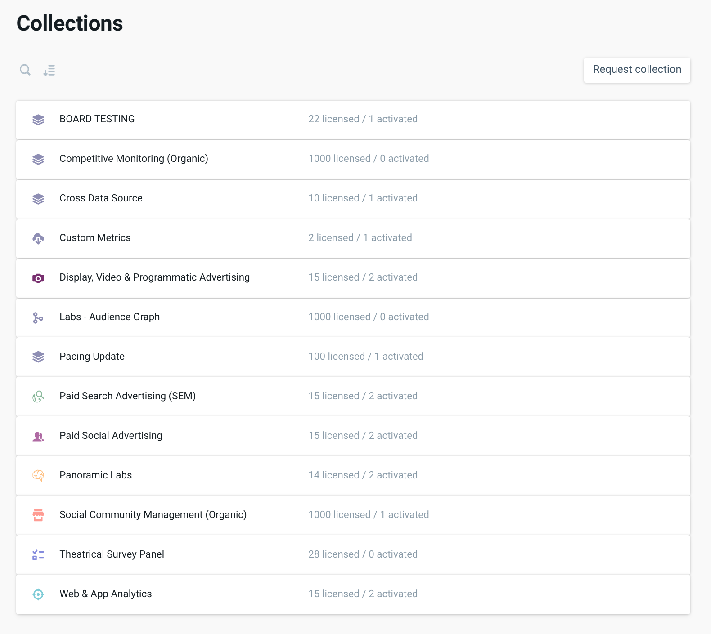
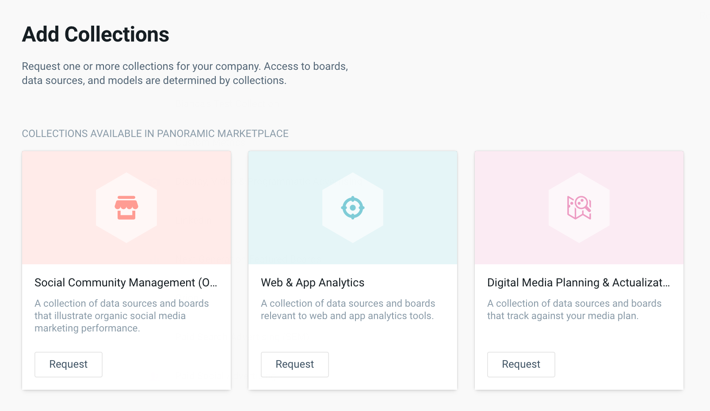

# Collections

This will evolve into templates

## What are Collections?

Before you can see any of your data populate within the Panoramic platform, let your Customer Success representative know what type of marketing you are doing, or what channel performance you would like to see displayed within Panoramic. This process is easily achieved by activating Collections.

Collections on Panoramic are a package of visuals and Data Sources pertaining to one method of marketing \(e.g. social media, programmatic, etc\). Data Sources that use similar reporting metrics are grouped by Collection so you can quickly view performance across channels.

Upon signing up to the Panoramic platform, your Customer Success representative will activate any relevant Collections at the Company level. Next, you’ll need to add these Collections to any of your desired Workspaces. Collections can be thought of as the battery that powers a Workspace. Activating a Collection is the first critical step toward viewing marketing performance.

 Currently, the following Collections are available:

* Custom Metrics
* Digital Media Planning & Activation
* Display, Video, & Programmatic Advertising
* Mixpanel
* Paid Search Advertising
* Paid Social Advertising
* Social Community Management \(Organic\)
* Website & App Analytics

## Requesting Collections

* The market place will let the company admins set up the workspace collections without the help of our staff up to purchased/agreed limits. 
* Introducing collections marketplace, place where all users can see our public collection which can be connected or requested by company admin.
  * Each collection will have detail with description, connected boards and data sources. 
  * The market place will let the company admins set up the workspace collections without the help of our stuff up to purchased/agreed limits. 
* A company admin will see purchased collection with the number of licenses. Used licensed will be counted per active workspace. 
* In the company glossary will be available only terms set in all connected collections.

