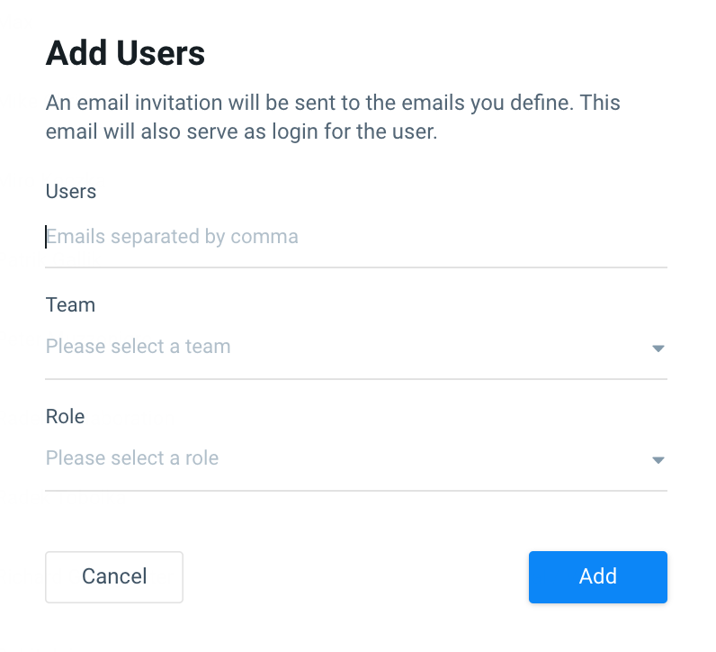

# Users

## **Adding Users**

It’s time to add Users and grant others access to Pano so you can all begin to visualize and analyze your data together.

Users are any colleague or representative who you would like to give access to your data. Within Pano, there are three types of User Roles: Admin, Edit, and View Users. See below for a breakdown of functionality per role.

To Add a User at the Company Level:

1. Log in to your Pano account
2. Under your Company Settings Menu, navigate to the **USERS** tab
3. Select **ADD USERS** on the top right corner
4. Enter the User’s company Email Address, Team, and Role
5. Select **ADD**

_Note: Users are added at the Company level only, while Collaborators are added only at the Workspace level in the case that you grant other Companies access to your data, and want to set permissions around their access \(i.e. different agencies per Workspace, or different levels of access per Workspace\)._

## Roles & Permissions

| **Functions** | Admin | Edit | View |
| :--- | :--- | :--- | :--- |
| Add New Users to Company | ✔️ | - | - |
| Share Company Access | ✔️ | - | - |
| Manage Workspace Settings | ✔️ | ✔️ | - |
| Create Terms in Company Glossary | ✔️ | ✔️ | - |
| Add and Remove Data Sources | ✔️ | ✔️ | - |
| Create/Edit Boards and Charts, Including Drafts | ✔️ | ✔️ | - |
| View and Comment in Collaboration | ✔️ | ✔️ | ✔️ |
| View Published Boards and Charts | ✔️ | ✔️ | ✔️ |

## Setting up Single Sign-on \(SAML\)

\[Enterprise Tier Only\]

Single Sign-on \(SSO\) is an added security benefit and convenience that is available to our enterprise tier clients. If you would like to connect the Pano platform to your existing identity provider, please reach out to your account rep.

### **Information that Pano will need from your IT team**:

* IdP Issuer URI
* IdP Single Sign-On URL
* IdP public certificate
* A test account that Pano can use to test sign on and potentially troubleshoot issues

### **Information Pano will provide to the customer**

* The Audience URI value
* The Assertion Consumer Service URL
* SAML metadata file

