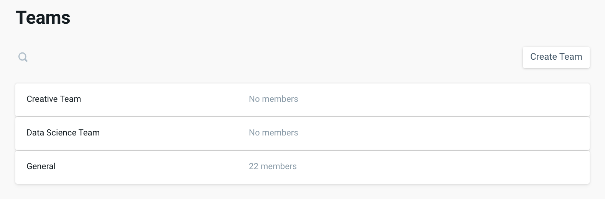

# Teams

### **Adding Teams**

Teams are groups of Users that you can set up to enable quick communication.

To Create a Team:

1. Log in to your Pano account
2. Under your Company Settings Menu, navigate to the **TEAMS** tab
3. Select **CREATE TEAM** on the top right corner
4. Enter the Team name you wish to use. Common examples include Data Science, Marketing, Operations, Paid Media, etc.
5. Select **CREATE**

_Note: Teams can be edited anytime in Company Settings. If you don’t yet know which teams you want to create, you can initially create a default “General” team and edit later._

