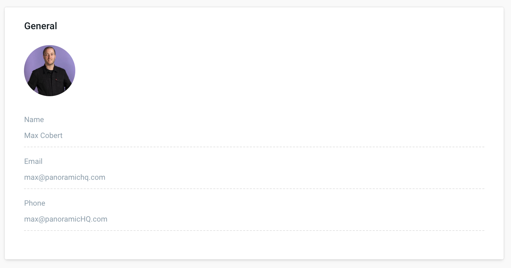

# Your Profile

## General Info

Your profile stores the general information about your account. This includes your name, email and avatar. These fields are filled out during registration but you can always return to your profile to edit them later on.

## Generating an API token

Certain licenses include access to the Pano API and CLI. In order to access the API you will need to generate a user key. This key will allow you to authenticate with the API and start modeling and querying data. 

Click the "Generate User Key" button in order to create a new token. Be sure to save the details of the token in a safe spot because you will not be able to access them again in the UI once you close the modal. 

